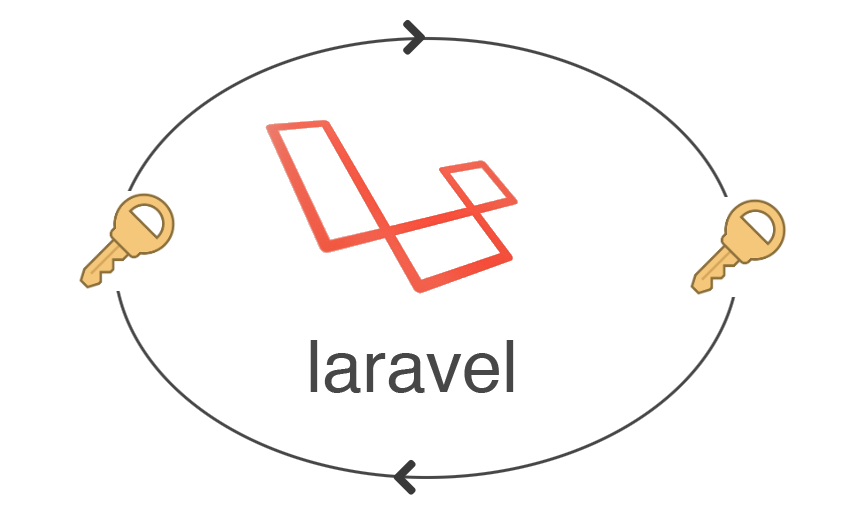

# Laravel Re-encrypt after APP_KEY rotation

A helper library to re-encrypt the existing encrypted data when you rotate your Laravel APP_KEY

    

The APP_KEY is used to keep your user sessions and other encrypted data secure! If the application key is not set, your user sessions and other encrypted data will not be secure. Believe it or not it is a big security risk.

To give you more specific context, earlier laravel had a security issue :

If your application's encryption key is in the hands of a malicious party, that party could craft cookie values using the encryption key and exploit vulnerabilities inherent to PHP object serialization / unserialization, such as calling arbitrary class methods within your application.

Hence, it is important to rotatate your APP_KEY in frequent invertals. [`Know More`](https://techsemicolon.github.io/blog/2019/06/10/aws-update-ami-systems-manager-automation/)

## How can you use this package : 

When APP_KEY is changed in an existing app, any data in your app which you have encrypted using Crypt facade or encrypt() helper function will no longer be decrypted as the encryption uses the APP_KEY.

So when you run `php artisan key:generate` to have a new key as part of key rotation, you need to first decrypt the old encrypted using old APP_KEY and then re-encrypt using newly generated APP_KEY. 

## Installation : 

~~~bash
composer require techsemicolon/laravel-app-key-rotation
~~~

## Usage : 

You can instantiate the `ReEncryptor` class by passing old APP_KEY. For that it is important for you to keep your old APP_KEY safe for reference before you rotate APP_KEY to a new one.

~~~php
// This is your old APP_KEY
$oldAppKey = "your_old_app_key";

// Instantiate ReEncryptor
$reEncryptor = new ReEncryptor($oldAppKey);

// Re-cncrypt the oldEncryptedPayload value
$newEncryptedPayload = $reEncryptor->encrypt($oldEncryptedPayload);
~~~

##Suggestion : 

When you update your database by new encrypted payload values, make sure you have another column in which you store the old encrypted payload value as a backup. This is to prevent any data loss during the key rotation.

##Example :

Let's imagine we have a column called `bank_account_number` in `users` table which is stored as encrypted string. We have another column in the same table as `old_bank_account_number` to store old encrypted payload as backup.

We can create a command `php artisan encryption:rotate` :

~~~php
<?php

namespace App\Console\Commands;

use App\User;
use Illuminate\Console\Command;
use Illuminate\Encryption\Encrypter;

class EncryptionRotateCommand extends Command
{
    /**
     * The name and signature of the console command.
     *
     * @var string
     */
    protected $signature = 'encryption:rotate {--oldappkey= : Old app key}';

    /**
     * The console command description.
     *
     * @var string
     */
    protected $description = 'Re-encrypt when APP_KEY is rotated';

    /**
     * Create a new command instance.
     *
     */
    public function __construct()
    {
        parent::__construct();
    }

    /**
     * Function to re-encrypt when APP_KEY is rotated/changed
     * 
     * @param string $oldAppKey
     * @param mixed $value
     */
    public function handle()
    {
        // This is your old APP_KEY
        $oldAppKey = $this->option('oldappkey');

        // Instantiate ReEncryptor
        $reEncryptor = new ReEncryptor($oldAppKey);

        User::all()->each(function($user) use($reEncryptor){

            // Stored value in a backup column
            $user->old_bank_account_number  = $user->bank_account_number;

            // Re-cncrypt the old encrypted payload value
            $user->bank_account_number  = $reEncryptor->encrypt($user->bank_account_number);
            $user->save();

        });

        $this->info('Encryption completed with newly rotated key');
    }
}
~~~

For more detailes about why and how of laravel APP_KEY rotation, [`click here`](https://techsemicolon.github.io/blog/2019/06/10/aws-update-ami-systems-manager-automation/)

## License : 

This psckage is open-sourced software licensed under the MIT license